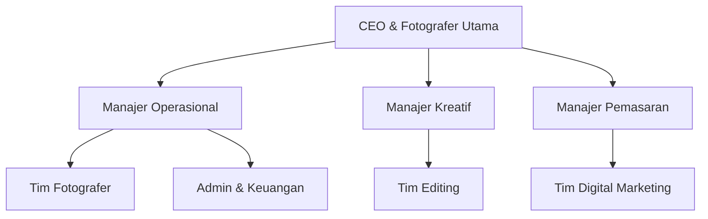
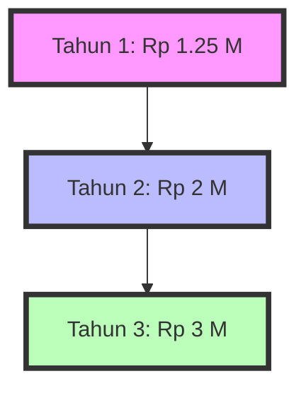

# Proposal Kewirausahaan: Lensa Kreativa Studio

## Daftar Isi
1. [Ringkasan Eksekutif](#ringkasan-eksekutif)
2. [Latar Belakang](#latar-belakang)
3. [Deskripsi Usaha](#deskripsi-usaha)
4. [Analisis Pasar](#analisis-pasar)
5. [Strategi Pemasaran](#strategi-pemasaran)
6. [Rencana Operasional](#rencana-operasional)
7. [Proyeksi Keuangan](#proyeksi-keuangan)
8. [Analisis Risiko](#analisis-risiko)
9. [Rencana Pengembangan](#rencana-pengembangan)
10. [Kesimpulan](#kesimpulan)

## Ringkasan Eksekutif

Lensa Kreativa Studio adalah sebuah startup yang inovatif di bidang fotografi, didirikan oleh seorang mahasiswa Informatika semester 5 yang memiliki passion mendalam dalam seni visual. Kami bertujuan untuk merevolusi industri fotografi dengan menggabungkan keahlian teknis fotografi dan teknologi digital terkini.

Visi kami adalah menjadi pionir dalam menciptakan pengalaman fotografi yang tak terlupakan, sambil membantu klien mengabadikan momen berharga dan meningkatkan branding bisnis mereka melalui gambar yang memukau.

## 1. Latar Belakang

### a. Latar Belakang Usaha

Di era digital ini, kebutuhan akan konten visual berkualitas tinggi terus meningkat. Menurut studi terbaru, 65% konsumen lebih tertarik pada brand yang menggunakan foto profesional dalam pemasaran mereka. Selain itu, tren "Instagrammable" telah menciptakan permintaan besar akan lokasi dan momen fotogenik.

### b. Profil Usaha

**Nama Usaha:** Lensa Kreativa Studio  
**Tagline:** "Mengabadikan Momen, Menciptakan Keajaiban"  
**Bentuk Usaha:** Studio Fotografi & Digital Imaging  
**Lokasi:** Jl. Kreativitas No. 123, Kota Inovasi  

### c. Sejarah Usaha

Lensa Kreativa Studio lahir dari passion [Nama Anda], seorang mahasiswa Informatika yang memiliki keahlian unik dalam memadukan fotografi dan teknologi digital. Berawal dari proyek kuliah yang mendapat pujian, [Nama Anda] melihat peluang besar untuk mengembangkan bisnis yang menggabungkan kedua bidang ini.

### d. Kategori Usaha

- Industri Kreatif
- Jasa Fotografi
- Digital Imaging & Post-processing

### e. Kondisi Perkembangan Usaha Saat ini

Saat ini, Lensa Kreativa Studio berada dalam tahap persiapan peluncuran. Kami telah:
- Melakukan riset pasar komprehensif
- Mengembangkan prototype layanan
- Membangun jaringan dengan potential partners
- Menyusun tim inti yang terdiri dari fotografer berbakat dan ahli IT

### f. Struktur Usaha

## 2. Deskripsi Usaha

### a. Noble Purpose

"Kami berkomitmen untuk mengabadikan keindahan dalam setiap momen, membantu bisnis berkembang melalui visual yang menginspirasi, dan mendorong kreativitas dalam industri fotografi."

### b. Konsumen Potensial

1. **Pasangan Millennial** (25-35 tahun)
   - Mencari dokumentasi pernikahan unik
   - Budget: Rp 15-30 juta

2. **Keluarga Muda** (30-40 tahun)
   - Ingin mengabadikan pertumbuhan anak
   - Budget: Rp 2-5 juta per sesi

3. **UMKM & Startup**
   - Membutuhkan foto produk dan branding
   - Budget: Rp 5-15 juta per proyek

4. **Korporasi**
   - Dokumentasi acara dan foto profil eksekutif
   - Budget: Rp 20-50 juta per kontrak tahunan

5. **Influencer & Content Creator**
   - Mencari konten visual berkualitas tinggi
   - Budget: Rp 3-7 juta per sesi

### c. Produk & Layanan

1. **Fotografi Pernikahan Futuristik**
   - Penggunaan drone untuk aerial shots
   - Edisi video pendek untuk media sosial

2. **Potret Keluarga Interaktif**
   - Sesi foto yang menggabungkan AR (Augmented Reality)
   - Album fisik dengan fitur "living photo"

3. **Fotografi Produk 360°**
   - Pembuatan konten visual untuk e-commerce
   - Integrasi dengan platform VR untuk showcase produk

4. **Dokumentasi Event Holografik**
   - Capture momen dengan teknologi holografik
   - Live streaming 360° untuk audiens virtual

5. **Personal Branding Package**
   - Sesi foto profesional
   - Konsultasi image dan pembuatan portofolio digital

### d. Sumber Daya

1. **Sumber Daya Manusia:**
   - 1 Fotografer Utama (CEO)
   - 2 Fotografer Asisten
   - 1 Ahli Editing & Post-processing
   - 1 Spesialis Digital Marketing
   - 1 Admin & Akuntan

2. **Peralatan:**
   - 2 Kamera Mirrorless High-end (Sony A1, Canon R5)
   - Lensa: 24-70mm f/2.8, 70-200mm f/2.8, 85mm f/1.4, 35mm f/1.4
   - Drone DJI Mavic 3 Pro
   - Lighting: 2 Godox AD600 Pro, 4 Godox V1
   - Komputer Editing: iMac Pro & MacBook Pro
   - Software: Adobe Creative Suite, Capture One, DaVinci Resolve

3. **Studio:**
   - Area 100m² dengan cyclorama wall
   - Ruang makeup dan persiapan klien
   - Area resepsi dan galeri mini

### e. Pemasaran

1. **Digital Marketing:**
   - Instagram & TikTok: Konten edukatif & behind the scenes
   - YouTube: Tutorial fotografi & showcase proyek
   - Google Ads: Targeted campaigns untuk keyword fotografi

2. **Kolaborasi:**
   - Partnership dengan wedding organizer
   - Kerjasama dengan influencer lokal

3. **Community Building:**
   - Workshop fotografi bulanan
   - Photo walk dengan komunitas lokal

4. **Content Marketing:**
   - Blog dengan tips fotografi dan tren industri
   - E-book gratis "Panduan Fotografi untuk Pemula"

5. **Pameran & Event:**
   - Partisipasi dalam wedding expo tahunan
   - Showcase di festival seni lokal

### f. Keuangan

1. **Modal Awal:** Rp 500.000.000
   - Equipment: 60%
   - Sewa & Renovasi Studio: 25%
   - Marketing & Branding: 10%
   - Operasional Awal: 5%

2. **Proyeksi Pendapatan Tahun Pertama:**
   - Target: Rp 1.200.000.000
   - Break Even Point: Bulan ke-9

3. **Struktur Biaya:**
   - Fixed Cost: 40% (Sewa, Gaji, Utilitas)
   - Variable Cost: 35% (Bahan, Transportasi, Marketing)
   - Profit Margin Target: 25%

## 3. Analisis Pasar

### Ukuran Pasar
- Nilai industri fotografi di Indonesia: Rp 20 triliun (2023)
- Pertumbuhan tahunan: 7.5%

### Tren Pasar
1. Peningkatan permintaan untuk konten visual di media sosial
2. Popularitas pre-wedding shoot dan destination wedding
3. Kebutuhan foto produk berkualitas untuk e-commerce

### Analisis Kompetitor

| Aspek | Lensa Kreativa | Kompetitor A | Kompetitor B |
|-------|----------------|--------------|--------------|
| Harga | ⭐⭐⭐⭐ | ⭐⭐⭐ | ⭐⭐⭐⭐⭐ |
| Kualitas | ⭐⭐⭐⭐⭐ | ⭐⭐⭐⭐ | ⭐⭐⭐⭐ |
| Inovasi | ⭐⭐⭐⭐⭐ | ⭐⭐⭐ | ⭐⭐ |
| Pelayanan | ⭐⭐⭐⭐ | ⭐⭐⭐⭐ | ⭐⭐⭐ |

## 4. Strategi Pemasaran

### Digital Presence
- Website interaktif dengan portfolio 3D
- Aktif di Instagram, TikTok, dan YouTube
- SEO optimization untuk keyword fotografi lokal

### Loyalty Program
- "Capture Points" untuk setiap booking
- Diskon untuk referrals

### Paket Bundling
- "Wedding Complete": Pre-wedding + Wedding Day + Photo Album
- "Business Starter": Product Shoot + Company Profile + Staff Headshot

### Seasonal Campaigns
- "Summer Family Fest": Diskon untuk foto keluarga saat liburan
- "New Year, New You": Paket foto profil profesional awal tahun

## 5. Rencana Operasional

### Tahap 1: Persiapan (Bulan 1-2)
- Finalisasi sewa studio
- Pembelian dan set up peralatan
- Rekrutmen dan training tim

### Tahap 2: Soft Launch (Bulan 3-4)
- Peluncuran website dan sosial media
- Promosi "Early Bird" untuk 50 klien pertama
- Kolaborasi dengan 3 influencer lokal

### Tahap 3: Full Operation (Bulan 5-12)
- Layanan penuh untuk semua kategori fotografi
- Implementasi strategi marketing agresif
- Evaluasi dan optimisasi proses bisnis

## 6. Proyeksi Keuangan

### Tahun 1

| Kuartal | Pendapatan | Pengeluaran | Profit |
|---------|------------|-------------|--------|
| Q1 | Rp 200.000.000 | Rp 180.000.000 | Rp 20.000.000 |
| Q2 | Rp 300.000.000 | Rp 240.000.000 | Rp 60.000.000 |
| Q3 | Rp 350.000.000 | Rp 260.000.000 | Rp 90.000.000 |
| Q4 | Rp 400.000.000 | Rp 280.000.000 | Rp 120.000.000 |

Total Profit Tahun 1: Rp 290.000.000

### Proyeksi 3 Tahun

## 7. Analisis Risiko

| Risiko | Probabilitas | Dampak | Mitigasi |
|--------|--------------|--------|----------|
| Persaingan Ketat | Tinggi | Sedang | Fokus pada diferensiasi dan inovasi |
| Kerusakan Alat | Sedang | Tinggi | Asuransi peralatan & backup gear |
| Fluktuasi Permintaan | Tinggi | Tinggi | Diversifikasi layanan & paket flexibel |
| Perubahan Teknologi | Tinggi | Sedang | Alokasi dana untuk upgrade rutin |

## 8. Rencana Pengembangan

### Tahun 2
- Pembukaan cabang di kota besar lainnya
- Peluncuran aplikasi mobile untuk booking & preview
- Investasi dalam teknologi VR untuk virtual tour

### Tahun 3
- Ekspansi ke pasar internasional (Singapore & Malaysia)
- Peluncuran academy fotografi online
- Pengembangan lini produk merchandise fotografi

## 9. Kesimpulan

Lensa Kreativa Studio memiliki potensi besar untuk menjadi pemain utama dalam industri fotografi dengan pendekatan inovatif dan fokus pada teknologi. Dengan kombinasi unik antara keahlian fotografi dan pemahaman teknologi digital, kami yakin dapat memberikan nilai tambah yang signifikan bagi klien dan industri secara keseluruhan.

Kami mengundang Anda untuk bergabung dalam perjalanan kami mengubah cara dunia melihat dan mengabadikan momen berharga.

